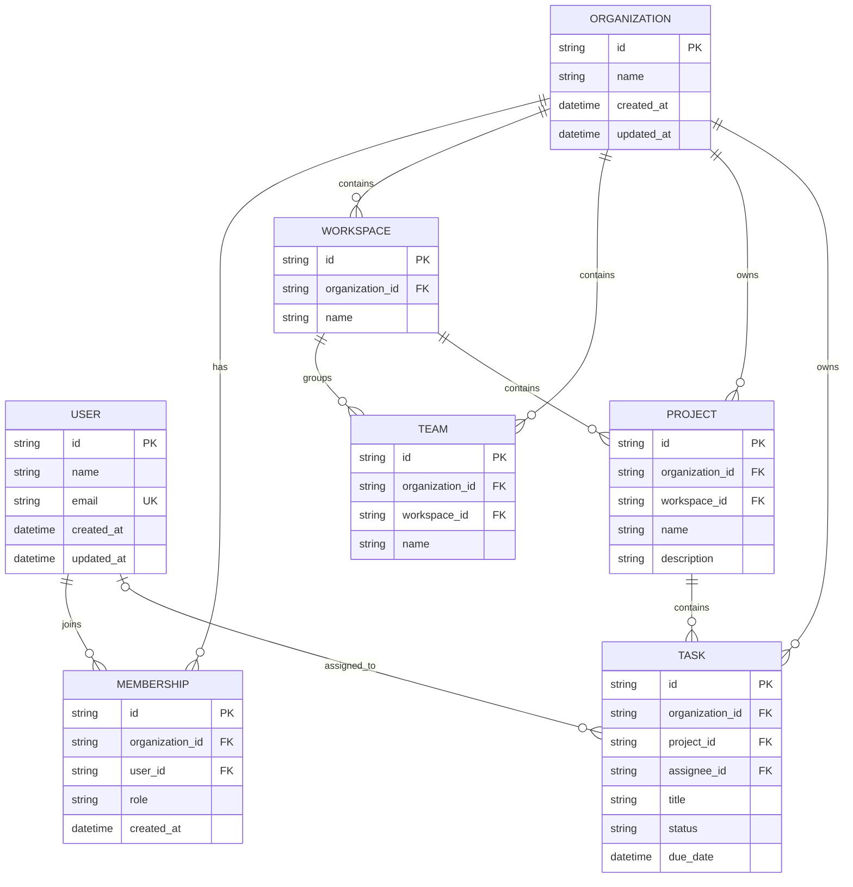

# Qveto Database ER Diagram

```mermaid
erDiagram
    ORGANIZATION ||--o{ MEMBERSHIP : has
    USER ||--o{ MEMBERSHIP : joins

    ORGANIZATION ||--o{ WORKSPACE : contains
    ORGANIZATION ||--o{ TEAM : contains
    ORGANIZATION ||--o{ PROJECT : owns
    ORGANIZATION ||--o{ TASK : owns

    WORKSPACE ||--o{ TEAM : groups
    WORKSPACE ||--o{ PROJECT : contains

    PROJECT ||--o{ TASK : contains
    USER o|--o{ TASK : assigned_to

    ORGANIZATION {
        string id PK
        string name
        datetime created_at
        datetime updated_at
    }

    USER {
        string id PK
        string name
        string email UK
        datetime created_at
        datetime updated_at
    }

    MEMBERSHIP {
        string id PK
        string organization_id FK
        string user_id FK
        string role
        datetime created_at
    }

    WORKSPACE {
        string id PK
        string organization_id FK
        string name
    }

    TEAM {
        string id PK
        string organization_id FK
        string workspace_id FK
        string name
    }

    PROJECT {
        string id PK
        string organization_id FK
        string workspace_id FK
        string name
        string description
    }

    TASK {
        string id PK
        string organization_id FK
        string project_id FK
        string assignee_id FK
        string title
        string status
        datetime due_date
    }
```
